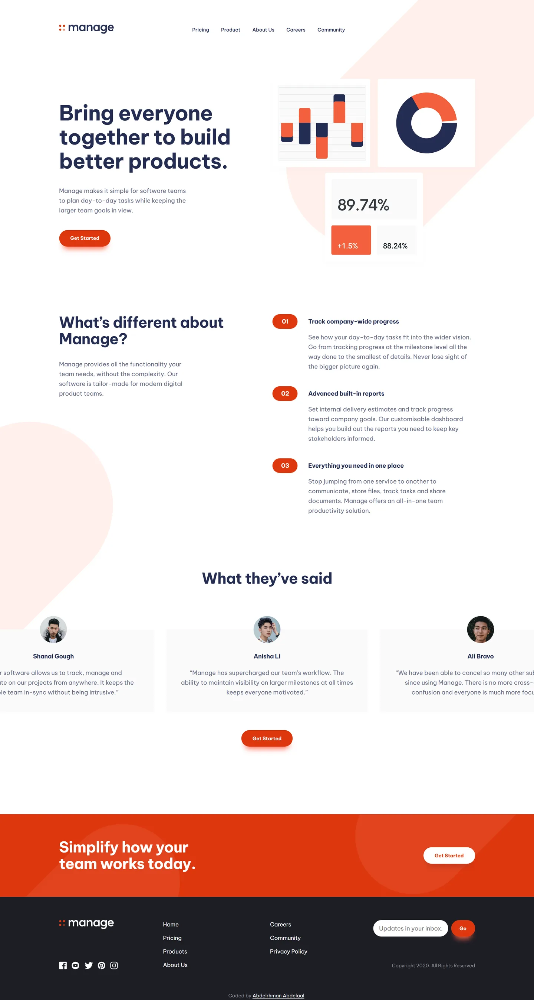

# Frontend Mentor - Manage landing page solution

This is a solution to the [Manage landing page challenge on Frontend Mentor](https://www.frontendmentor.io/challenges/manage-landing-page-SLXqC6P5). Frontend Mentor challenges help you improve your coding skills by building realistic projects.

## Table of contents

- [Overview](#overview)
  - [Screenshot](#screenshot)
  - [Links](#links)
- [My process](#my-process)
  - [Built with](#built-with)
  - [Design deviations](#design-deviations)
- [Author](#author)

## Overview

### Screenshot

### Links

- Solution URL: [GitHub](https://github.com/MrBlackvanta/manage-landing-page)
- Live Site URL: [Cloudflare](https://manage-landing-page.abdelrhman-ahmed8881.workers.dev)
- Mirror: [Netlify](https://vanta-manage-landing-page.netlify.app)

## My process

### Built with

- [Next.js 16](https://nextjs.org/) (App Router, React Compiler, Turbopack)
- [React 19](https://react.dev/)
- [TypeScript](https://www.typescriptlang.org/) (strict)
- [Tailwind CSS v4](https://tailwindcss.com/)
- [Embla Carousel](https://www.embla-carousel.com/) for the testimonial slider

### Design deviations

**Half the design's text pairings fail WCAG AA.** Twelve of twenty-four fail when each is
measured against the backdrop it actually sits on — decorative shapes composited in, not just
white. Every ratio below is measured from the production build on rounded 8-bit channels.

|                             | design    | contrast                 | shipped   | contrast               |
| --------------------------- | --------- | ------------------------ | --------- | ---------------------- |
| Body copy (every paragraph) | `#9196A8` | 2.97 / 2.93 / 2.88       | `#686E88` | 5.03 / 4.82 / **4.53** |
| Brand red (buttons, badges) | `#F3603C` | 3.00 label, 3.21 numeral | `#DE370E` | 4.51 / 4.51            |
| Button hover fill           | `#F98F75` | 2.13                     | `#C0300C` | 5.72                   |
| Input placeholder           | `#8D8D8D` | 3.32                     | `#767676` | 4.54                   |
| Error text on white         | `#F33C3C` | 3.80                     | `#EC0F0F` | 4.52                   |
| Error text on `#1D1E25`     | `#F33C3C` | 4.37                     | `#F34343` | 4.50                   |

The three body-copy ratios are white, the `#FAFAFA` testimonial card, and the `#FFF0EC` shape
the mobile hero paragraph crosses. **The pale shape governs the value** — solving for white and
the card alone allows `#6C738B`, which then lands at 4.24 over the shape. The design's grey is
not a paint at all: it is Dark Blue at `opacity: 0.5025`, and the style guide's
`hsl(227, 12%, 61%)` is just that composite over white, rounded.

The error red needs **two** tokens because no single value can work: on white it must sit at
luminance ≤ 0.183, on `#1D1E25` at ≥ 0.241.

Darkening the brand costs the hover direction. At `#DE370E` the fill is already at the lightness
ceiling for white text, so hover darkens rather than lightens as the design does. The button
glow keeps the design's relationship to the fill (+18.4 lightness points), so it moves with it,
`#FF9F8E` → `#FF664B`.

**Two style-guide colours are wrong.** The design paints Bright Red `#F3603C`, not `#F25F3A`,
and Very Pale Red `#FFF0EC`, not `#FFEFEB`. Dark Blue, Very Dark Blue and Very Light Gray are
exact. The design also uses four colours the guide never lists: `#F98F75`, `#F33C3C`, `#8D8D8D`,
and `#FCF6F5` for button labels — that last one is a warm near-white that buys nothing, so
labels ship pure white, which is also worth +0.21 of contrast.

**The design file is set in "Be Vietnam", not "Be Vietnam Pro".** Different family, wider
metrics. The hero's three-line break needs 458px where the design's text frame is 445, so the
heading column widens to 465 and the gutter beside it narrows to compensate — the artwork stays
on its 735px edge. Line height is affected too: every `leading: normal` node measures 1.44–1.47×
in the file, and Be Vietnam Pro's own `normal` is 1.27×, so the roles that depend on their box
height carry an explicit line height rather than inheriting either.

**The design has no tablet frame.** One structural breakpoint at 1024px; below it the mobile
layout holds with prose capped at 32rem so lines do not run to 90 characters at 900px wide. The
hero display size is fluid between 1024 and 1440 — pinned at 56px it wraps to five lines at 1024.

**Where the design disagrees with itself, and what shipped:**

- Mobile section headings are drawn at 30px and 32px for the same role, in ExtraBold, with the
  hero paragraph in Light. Neither weight is in the style guide's 400/500/700. One size, Bold.
- The three mobile feature bars are drawn two ways — two square at 359×39 flush to the right
  edge, one a 382×39 pill overflowing the viewport by 24px. All three ship as pills ending at
  the viewport edge.
- The footer insets its content to x=171 where every other section uses 165, and the desktop
  CTA button lands at x=1279, four pixels past the 1275 content edge. Both ship at 165/1275.
- The header logo sits 7px below the centre of a row whose nav and button are centred. It is
  centred.
- The mobile footer centres its logo, social row and copyright, but the link columns sit at
  63–327 on a 375 frame, 7.5px right of centre. The block is centred. Inside it the two columns
  are spread to its edges, as the design draws them — the design's 169px column pitch, not two
  equal halves — leaving 4.7px of the wider font as the only residual.
- Mobile gutters run 16, 17, 22, 24, 26, 27, 29, 32 and 33.5px. Everything uses 24 except the
  feature block, which keeps 16 — that is the gutter that gives its paragraphs the design's
  four lines.

**Two places where the page will not pixel-match the mock.** The mobile section intro is
hard-wrapped to four lines in the design and wraps naturally to three, so everything below it
sits about 21px higher. And the footer is taller than the mock because it carries the
attribution line, which the mock has no room for — 275 against 250 on desktop, and 581 against
537 at 375, where the attribution wraps to two lines.

**The slider loops and drags, neither of which the design specifies.** It runs on
[Embla Carousel](https://www.embla-carousel.com/), which was worth the 5 KB: a first pass built
on CSS scroll-snap had to reposition `scrollLeft` to fake the loop, and the snap engine fought
every correction — the wrap shook on touch and jumped abruptly from a dot press. Embla moves
slides with transforms instead of scroll offsets, so the loop has nothing to fight. It also
keeps exactly four slides in the DOM rather than cloning them, so the carousel reads as four
items to assistive technology with no `aria-hidden` copies. Slide spacing is slide padding
rather than a CSS `gap`, because Embla measures loop offsets from slide widths and a `gap`
leaves a short step beside a wrapped slide.

**The slider dots sit further apart than the design draws them.** The design's 7px dots are on
a 12px pitch, which fails WCAG 2.5.8: a 24px circle centred on each would overlap its
neighbour, and there is no arrangement of 7px dots 12px apart that passes. The dots keep their
7px appearance inside 24x24 buttons, so the pitch is 24px and the row is 96px wide rather than
43px.

**Slide width shrinks below 375px.** The design's card is 340 wide, which overflows a 320px
viewport, so the slide is `min(23.125rem, 100% - 2.1875rem)` — the design's width wherever it
fits and a proportional gutter below that.

**The menu button is one icon, not two.** Three bars that rotate and converge into the X rather
than a hamburger swapped for a close control. That rules out `<dialog showModal()>`, whose
modal inertness would make the button unclickable while the menu is open, so the menu is a
disclosure — `aria-expanded` plus `aria-controls` — with Escape, scrim-click, scroll lock and
focus return wired manually. Focus return matters and no automated audit catches it: all three
close paths leave focus on a link that is about to become `visibility: hidden`, so the next Tab
would restart from the top of the document. The morphed X is a little smaller than the 21x22 the design draws, because it
is the hamburger's own 25px bars rotated rather than a separate glyph.

**Section reveals are transform-only, no fade.** They are CSS scroll-driven animations
(`animation-timeline: view()`), gated behind both `prefers-reduced-motion` and an
`@supports` check, so there is no path where content stays hidden. Fading them was the obvious
choice and the wrong one: auditing tools scroll the page and sample elements partway through
the fade, reading half-opacity text as a contrast failure — it cost three false contrast
errors and took Accessibility to 92. Sliding without fading keeps the motion and the score.
The hero is deliberately excluded, since it holds the LCP.

**The avatars are not the photographs supplied with the challenge**, so the testimonial row
will not match the design JPGs.

## Author

- UpWork - [Abdelrhman Abdelaal](https://upwork.com/freelancers/~01f0a9479696b61f49)
- Frontend Mentor - [@MrBlackvanta](https://www.frontendmentor.io/profile/MrBlackvanta)
- LinkedIn - [Abdelrhman Abdelaal](https://www.linkedin.com/in/abdelrhman-vanta/)
